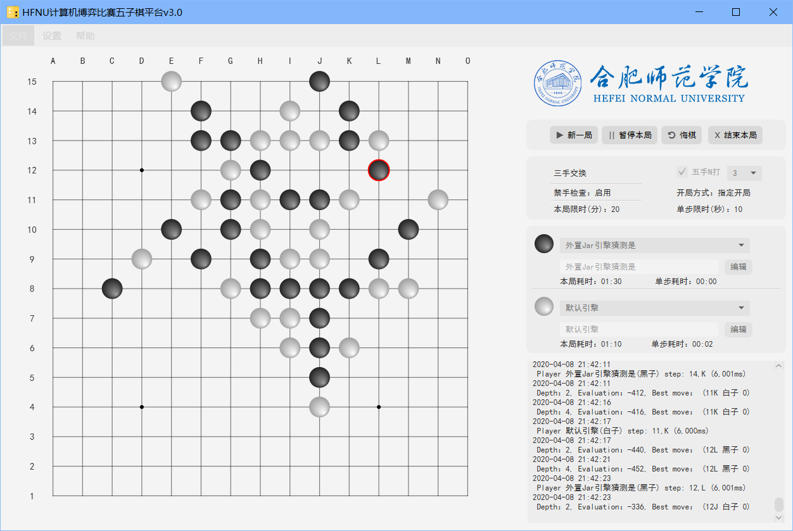
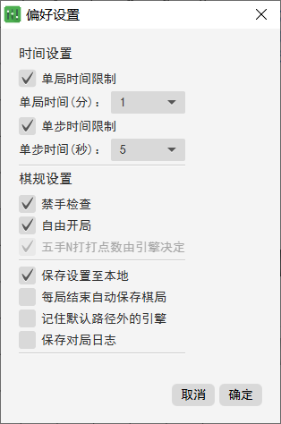
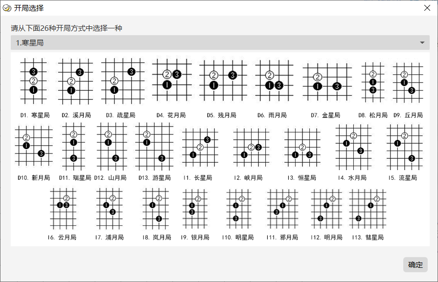

# 计算机博弈比赛五子棋平台

## 项目介绍

这是个用Java实现的用于合肥师范学院计算机博弈比赛的平台，图形界面用的JavaFX实现的。

此平台初步设计的功能可以让参加比赛的同学利用此平台提供的接口自己去实现博弈比赛的算法，将自己的算法打包成jar、so或者dll文件，然后用这个平台加载并调用之。

## 界面

### 主界面



### 偏好设置界面



### 选择开局界面



## 功能介绍

支持对禁手的检查;

支持单局、单步计时;

支持修改人来棋手的名字;

支持五子棋的人人、人机、机机游戏;

支持对局的开始、暂停、继续、悔棋与强制结束;

支持加载本平台之前保存的五子棋棋局及恢复游戏;

可自动加载`CGPData/ExtEngines`下的所有引擎文件;

开局选择、三手交换和五手N打均可实现手动选择或由引擎决定;

目前仅支持加载使用Java/C/C++实现本平台接口的五子棋引擎;

可自动保存棋局文件在`CGPData/HistoryChessBoardLogSaved`路径下。

其他......

### 添加外部算法引擎

目前仅支持实现自己定义接口的引擎。

#### 使用java

依据定义的引擎与平台交互的接口，实现自己的算法，并打包成jar，放在`CGPData\ExtEngines`下，重启平台可自动加载，亦或者点击“加载引擎”按钮，加载任意路径下的引擎。接口说明参见[这里](https://gitee.com/mdmbct/HFNUCGPCommonClass#%E4%BA%94%E5%AD%90%E6%A3%8B%E6%8E%A5%E5%8F%A3)。

#### 使用C/C++

依据定义的引擎与平台交互的接口，实现自己的算法，并打包成dll、so文件，放在`CGPData\ExtEngines`下，重启平台可自动加载，亦或者点击“加载引擎”按钮，加载任意路径下的引擎。接口说明参见[这里](https://gitee.com/mdmbct/HFNUCGPForConnect5EngineAPIInCpp)。

### 添加内部算法引擎

与添加外部引擎的去别在于这个直接在原来代码基础上添加引擎实现类，其他的和添加外部引擎一致。

#### 添加引擎信息

引擎实现类编写完后，需要通过配置告诉平台引擎类的实现。

参见[这里](https://gitee.com/mdmbct/HFNUCGPCommonClass)

**注：**

在2.0及之前版的平台代码中只能通过在`resources/EngineConfigs.xml`中添加引擎信息，在后续的版本中去除这个麻烦的设计。

对于这个文件，这里再提下，其中`name`是 引擎的名字，只能是唯一的，`chessTyp`只能填入`CONNECT5`，`entryClass`填入引擎入口类的完整名。以上三个是必须要填的。

`author`和`version`分别是引擎的作者和版本，不是必须要填的。

```xml
<?xml version="1.0" encoding="UTF-8"?>
<!DOCTYPE Configuration SYSTEM "source\format.dtd">
<Configuration>
    <Engine name="随机落子" chessType="CONNECT5" entryClass="pers.mdmbct.cgp.players.engineDeclare.random.RandomPlayer"
            author="MDMBCT" version="v2.0"/>
<!--<Engine name="YourEngineName" chessType="CONNECT5" entryClass="YourEngineEntryClass"-->
<!--        author="YourEngineAuthor" version="YourEngineVersion"/>-->
</Configuration>
```

编译运行便会看到添加的内部引擎


## 更新日志

### v3.0.2

右面板棋手控件稍微右移;

帮助页面显示内容字体替换为黑体;

DEBUG、ERROR日志记录增加版本输出;

增加保存棋局文件、对弈日志的提示信息;

修复当棋手上一步落子无效时,下一步落子时间记录错误的问题;

修复手动结束和自动结束后保存的棋局文件中棋手耗时为0的问题;

添加当默认路径下无引擎文件可供加载时控制台提示信息相关信息;

修复暂停当前对弈然后保存棋局导致棋局文件中记录某棋手本局耗时为0的问题.